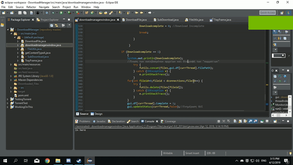

# DownloadManager
Το πρόγραμμα αυτήν την στιγμή μπορεί να κατεβάσει αρχεία  από άμεσους συνδέσμους με επιταχυμένη ταχύτητα όπου υποστιρίζεται,μέσω πολλαπλών συνδέσεων.  
Οταν το κουμπί download πατηθεί,ένα νήμα "DownloadFile" θα δημιουργηθεί,στο οποίο θα γίνει έλεγχος αν είναι δυνατον η επιλεκτική λήψη byte του αρχειου(isPartial).  
Αφού είναι true,θα δημιουργηθούν 5 νήματα SubDownload ta οποία αντιστοιχούν στο πατέρα νήμα DownloadFile για το συγκεκριμένο αρχείο,τα 5 αυτά νήματα είναι στην ουσία οι συνδέσεις οι οποίες θα κατεβάσουν κομμάτια του αρχείου.  
Αν το isPartial είναι false,τότε δημιουργήται ένα μόνο νήμα SubDownload.  
Αφού ολοκληρωθεί η λήψη,καλείται η μέθοδος concat από την κλάση FileUtils όπου θα ενώσει τα κομμάτια σε ένα αρχείο και η μέθοδος delete που θα διαγράψει τα ληφθέντα κομμάτια.  
Επίσης για κάθε DownloadFile νήμα,δημιουργήται και ένα νήμα Monitor το οποίο παρακολουθεί την προοδο της λήψης και ανανεώνει τον πινακα στο GUI με πληροφρίες όπως την πρόοδο % και το μέγεθος.  
Μπορεί να γίνει επισκόπηση της λήψης απο την γραμμή ειδοποιήσεων των windows πατώντας το ικονίδιο.

**New**:
Speed limit.  
Παύση/Συνέχεια Direct λήψεων.  
**New_2**:  
Πρόσθεση λήψης torrent μέσω **MAGNET LINK** με δυνατότητα παύσης και συνέχισης  
Αλλαγές στην παύση και συνέχεια των Direct λήψεων.  
**New_3**:  
Scheduler(Χρονοδιάγραμμα) και "Copy URL" στο context menu.  
**New_4**:  
Μετατροπέας αρχείων εικόνας,βίντεο,ήχου(η μετατροπή βίντεο και ήχου βασίζεται στο ffmpeg και πρέπει να είναι εγκατεστημένο στο σύστημα για να δουλέψει).  
(Το αρχείο που παράγεται δεν αντικαθιστά το αρχικό αρχείο.).Επιλογή άνοιγμα αρχείου/φακέλου και διαγραφής στο context μενού  

**Αν θέλετε να τεστάρετε το πρόγραμμα**

Maven project σε Java 8 1.8.0_201.  
Οι λήψεις καταλήγουν στο [user.home]\Downloads. 
Επίσης για το context menu στους πίνακες θα πρέπει η σειρά να είναι επιλεγμένη για να δουλέψουν οι λειτουργίες menu.  
Προαιρετικά:Να εγκαταστήσετε το FFmpeg(για να δουλέψει ο μετατροπέας αρχείων).

