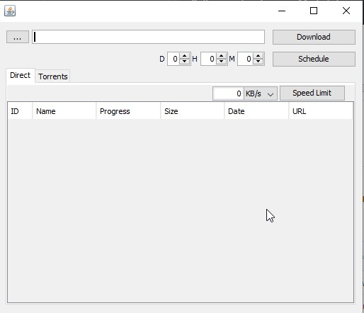

# DownloadManager  
A download manager program that supports direct downloads and torrents.Featuring download acceleration and option to throttle the speed of the direct downloads.All downloads can be paused,resumed and scheduled to start.Menu options to open the file,copy it's origin URL,open it on explorer,move it to different folder or delete it.Images,videos and audio files from direct downloads can be converted to a different format (video and audio requiring FFMPEG installed or ffmpeg.exe placed in the program's folder) 

GUI  
  
  
[Library use for torrent downloads.](https://github.com/atomashpolskiy/bt)  

**If you wanna try it**  

Maven project Java 8 1.8.0_201.  
The default download folder is [user.home]\Downloads.   
Optional: Install FFMPEG or place the ffmpeg.exe in the program folder,so the audio and video conversion will work.
